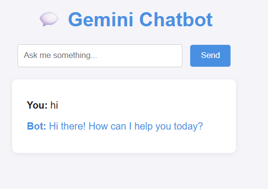

# Gemini Chatbot



A simple chatbot web application built with Python. This project features a user-friendly web interface and integrates with Google services to enhance chatbot capabilities.

## Project Explanation
Gemini Chatbot is designed to provide an interactive chat experience through a web interface. It leverages Python for backend logic and can connect to Google APIs for additional features such as search or data retrieval. The application is structured for easy deployment and customization, making it suitable for both learning and practical use cases.

## Features
- Chatbot interface
- Google integration
- Simple web UI

## Project Structure
- `app.py`, `main.py`, `google.py`: Main application files
- `static/`: Static assets (e.g., logo.png)
- `templates/`: HTML templates

## Setup
1. Clone the repository
2. Install dependencies (see below)
3. Run the app

## Installation
```powershell
pip install -r requirements.txt
```

## Running the App
```powershell
python app.py
```

## License
MIT
